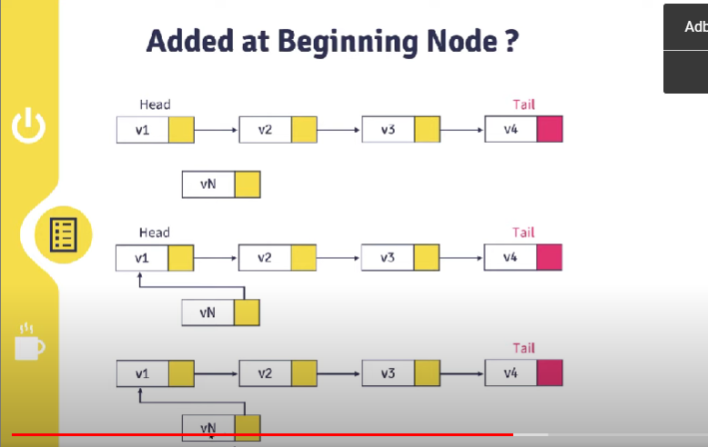
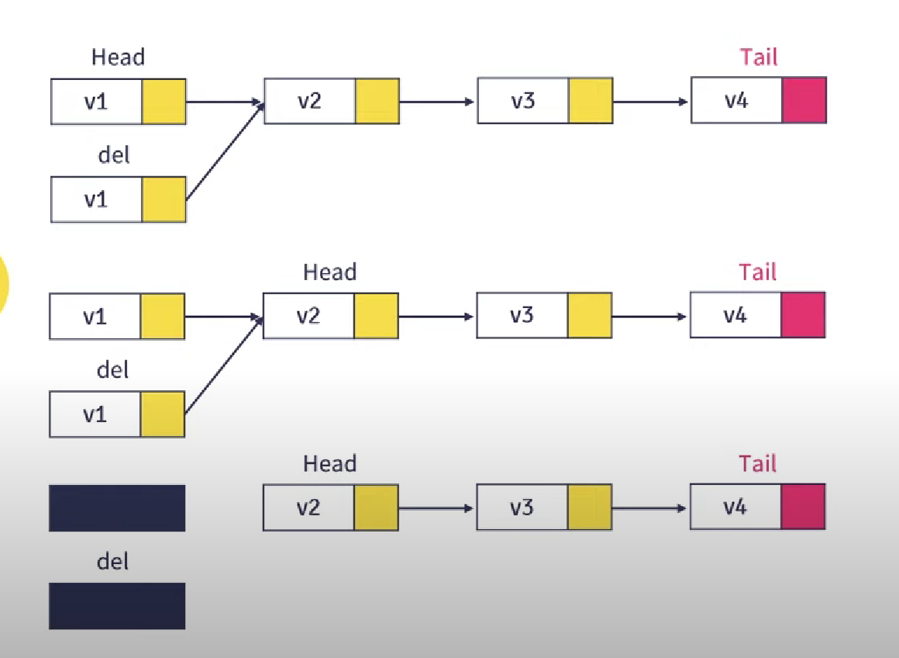
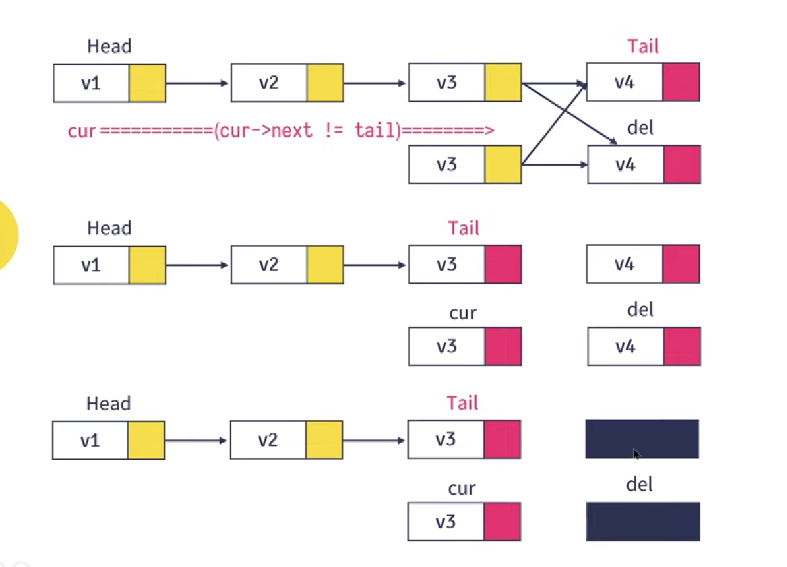

Tentu, saya akan melengkapinya. Berikut ini dokumentasi lengkap dengan kode program Anda yang disisipkan:

```markdown
# Implementasi Single Linked List dalam C++

## Linked List

- **Singkatnya Linked List**: Elemen yang terhubung dengan pointer.
- **Elemen Terakhir**: Menunjukkan ke NULL (untuk Linked List non Circular).
- **Dinamis**: Elemen dapat bertambah dan kurang secara dinamis selama program berjalan.
- **Alokasi Dinamis**: Dapat dibuat selama diperlukan (Hingga memori sistem Habis).
- **Keuntungan**: Linked list tidak membuang ruang memori, tetapi membutuhkan beberapa ekstra untuk pointer.

## Array Vs Linked List

- **Array**: Memiliki ruang atau aksesibilitas yang terbatas, sedangkan linked list dapat mengalokasi memori secara dinamis.
- **Node Awal & Akhir**: Istilah dari tail disebut dengan node akhir dan head disebut node awal.

## Tipe Linked List

- **Single Linked List (Singly Linked List)**
- **Double Linked List (Doubly Linked List)**
- **Circular Linked List**
- **Multiple Linked List**

## Single Linked List

### Deklarasi & Inisialisasi

```cpp
#include <iostream>

using namespace std;

// Deklarasi single linked list
struct Buku {
  // Komponen / member
  string judul, pengarang;
  int tahunTerbit;
  Buku *next;
};

Buku *head, *tail, *cur, *newNode, *del, *before; // Deklarasi pointer untuk node-nodenya

// Membuat single linked list
void createSingleLinkedList(string judul, string pengarang, int tB) {
  head = new Buku();
  head->judul = judul;
  head->pengarang = pengarang;
  head->tahunTerbit = tB;
  head->next = NULL;
  tail = head;
}
```

### Menambahkan Node di Awal



```cpp
// Menambahkan node di awal
void addFirst(string judul, string pengarang, int tB) {
  newNode = new Buku();
  newNode->judul = judul;
  newNode->pengarang = pengarang;
  newNode->tahunTerbit = tB;
  newNode->next = head;
  head = newNode;
}
```

### Menambahkan Node di Akhir


```cpp
// Menambahkan node di akhir
void addLast(string judul, string pengarang, int tB) {
  newNode = new Buku();
  newNode->judul = judul;
  newNode->pengarang = pengarang;
  newNode->tahunTerbit = tB;
  newNode->next = NULL;
  tail->next = newNode;
  tail = newNode;
}
```

### Menghapus Node Pertama



```cpp
// Menghapus node pertama
void removeFirst() {
  del = head;
  head = head->next;
  delete del;
}
```

### Menghapus Node Terakhir



```cpp
// Menghapus node terakhir
void removeLast() {
  del = tail;
  cur = head;
  while (cur->next != tail) {
    cur = cur->next;
  }
  tail = cur;
  tail->next = NULL;
  delete del;
}
```

### Ubah

```cpp
// Fungsi untuk mengubah data node pertama
void changeFirst(string judul, string pengarang, int tB) {
  head->judul = judul;
  head->pengarang = pengarang;
  head->tahunTerbit = tB;
}
